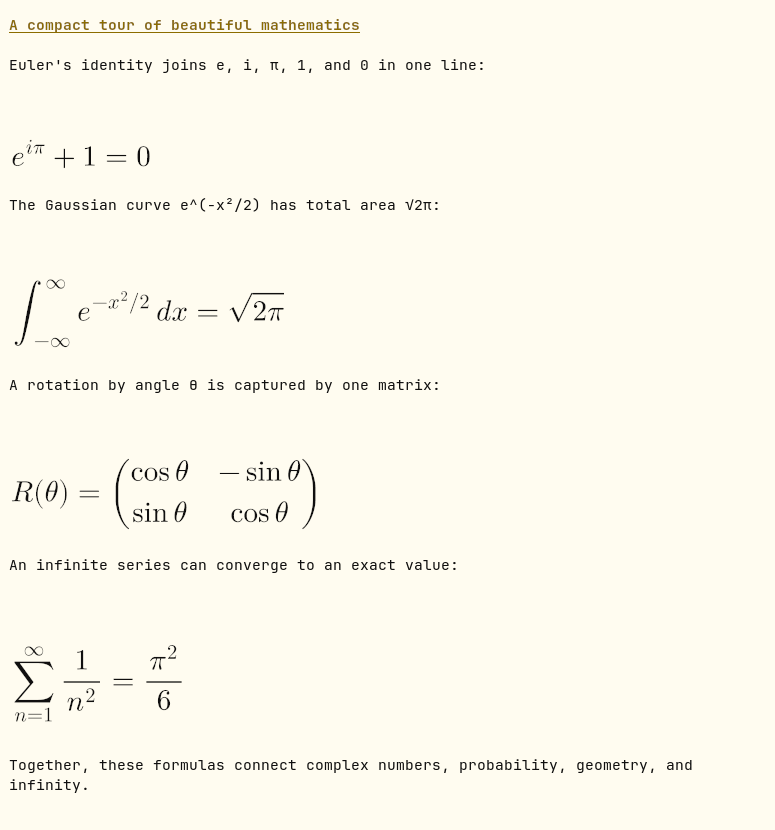

# Formula for Pi

[日本語](README.ja.md)

Readable LaTeX in Pi: selectable Unicode inline formulas and MathJax display-formula images.

## Install

Requires Pi 0.84 or later and Node.js 22.19 or later.

```sh
pi install npm:pi-formula
```

Pi loads the extension automatically. Ask the model to use `$...$` or `\(...\)` for inline formulas and `$$...$$` or `\[...\]` for display formulas.

## Preview

The Ghostty capture below shows Unicode inline formulas in the prose and MathJax images for display formulas at the same time.



## What it does

- **Inline formulas** (`$...$` and `\(...\)`) stay in Pi's Unicode text renderer. They remain selectable, searchable, and aligned with surrounding text.
- **Display formulas** (`$$...$$` and `\[...\]`) use transparent MathJax PNG images on the image path.
- If images are unavailable, display formulas use Pi's Unicode text path too.
- Only displayed Markdown changes. Saved messages and model context retain the original LaTeX.

Formula for Pi leaves code fences, inline code, thinking, escaped dollar signs, ordinary money, URLs, shell variables, ambiguous dollar signs, and incomplete formulas unchanged. A closed display formula can appear while a response is streaming and keeps its list or quote nesting.

If one display formula is invalid, exceeds a safety limit, lacks an exact theme RGB color, or would shrink below half size, only that formula stays as LaTeX. Later formulas continue rendering.

## `/formula` command

| Command | Effect |
| --- | --- |
| `/formula status` | Show the version, active path, selection reason, terminal, macro count, in-memory cache size, and latest failure. |
| `/formula image` | Select the image path for this Pi session. |
| `/formula text` | Select the text path for this Pi session. |
| `/formula auto` | Return this Pi session to automatic selection. |
| `/formula clear` | Remove rendered images and failures from the in-memory cache. |

Add `--default` to `image`, `text`, or `auto` to change the global default. For example, `/formula text --default` saves the text path. `/formula auto --default` removes the saved path. A command without `--default` affects only the current session.

## Configuration

The configuration file is `$XDG_CONFIG_HOME/pi-formula/config.json`, or `~/.config/pi-formula/config.json` when `XDG_CONFIG_HOME` is unset.

```json
{
  "macros": {
    "RR": "\\mathbb{R}",
    "pair": ["\\left(#1,#2\\right)", 2]
  }
}
```

`path` can be `image`, `text`, or omitted for automatic selection. `/formula` writes only explicit defaults; `auto` is represented by an omitted `path`.

`PI_FORMULA_MACROS` accepts the `macros` object itself as JSON and overrides valid names from the file:

```sh
export PI_FORMULA_MACROS='{"RR":"\\mathbb{R}"}'
```

An invalid JSON source is ignored. An invalid individual macro is ignored without disabling other definitions. Macro names contain ASCII letters. A definition is a replacement string or `[replacement, argumentCount]`, where `argumentCount` is an integer from 0 through 9. Write `\\#` for a literal hash.

## Supported terminals and operating systems

| Environment | Result |
| --- | --- |
| Ghostty on Linux or macOS | Image path after a successful PNG query |
| Kitty on Linux or macOS | Image path after a successful PNG query |
| Other terminals | Text path |
| tmux or screen | Text path; no image query |
| Non-interactive Pi modes | Text path; no terminal controls |

The supported image path is a direct Ghostty or Kitty session on Linux or macOS. A rejected or unanswered PNG query safely selects the text path. Windows and other terminal image protocols are not supported or verified in 0.1.0.

## Not supported and extension coexistence

Formula for Pi intentionally does not:

- render inline formulas as images;
- recognize LaTeX delimiters other than `$...$`, `\(...\)`, `$$...$$`, and `\[...\]`;
- guarantee images through terminal multiplexers;
- include subject-specific macros by default;
- provide an ES Modules entry point in 0.1.0.

Do not enable Formula for Pi with other math rendering extensions that transform the same Markdown. Their transformers can duplicate or corrupt output. `qni-cli` is the exception: it uses Formula for Pi's public API, supplies protected additional macros, and shares registration so that installing both still creates one formula renderer and one `/formula` command.

## Image safety

MathJax and Resvg load only when the first display formula enters the image path. SVG and PNG data stay in a bounded in-memory cache and are never written to disk. Rendering does not use a network connection, browser, or child process.

The fixed limits are 16,384 LaTeX characters, 255 image columns, 255 image rows, 64 cache entries, and 32 MiB of cached data. Each existing PNG is limited to 32 MiB and 4,194,304 expanded pixels. Failed formulas are cached, so repeated invalid input is not typeset again.

## Extension API

The CommonJS package root exports synchronous `registerFormula`, `createFormulaPng`, `getFormulaPath`, and `renderPng` operations. Internal subpaths are not public. Another Pi extension can register protected additional macros and create a display-formula PNG through the same rendering path:

```js
const {
  createFormulaPng,
  getFormulaPath,
  registerFormula,
  renderPng
} = require("pi-formula");

registerFormula(pi, {
  ket: ["\\left|#1\\right\\rangle", 1]
});

const image = createFormulaPng("\\ket{0}", availableWidth);

if (getFormulaPath() === "image") {
  const result = renderPng("/tmp/circuit.png", availableWidth);
  if (result.rendered) return result.output;
}
return asciiCircuit;
```

Additional macro names contain ASCII letters, with an optional leading backslash. Invalid additional macros make `registerFormula` throw `TypeError`. Additional macros override user macros and stay protected when standalone and bundled copies register in either order. Reloading or switching sessions rebinds the extension and reads user macros again.

`image` is `undefined` on the text path. On the image path it contains PNG `data`, pixel content size, and terminal column and row counts. It does not contain a Pi UI component. Each call returns an independent PNG buffer.

`getFormulaPath()` returns the current image or text path. `renderPng()` accepts a PNG `Buffer` or file path plus the maximum available columns. On the image path it calculates terminal columns and rows from the terminal dimensions, then returns the Kitty image transfer and placement in `output`. Return this string as the extension's displayed result. On the text path it returns `{ rendered: false, reason: "image-unavailable" }`, so the caller can select a fallback. A PNG whose signature, chunks, CRCs, or compressed data cannot be validated returns `invalid-png`. A PNG exceeding 32 MiB, 4,194,304 expanded pixels, or the fixed column or row limit returns `safety-limit`. File paths accept regular files only. These outcomes do not throw exceptions.

## Audit and releases

- [CHANGELOG.md](CHANGELOG.md) describes user-visible changes.
- [THIRD_PARTY_NOTICES.md](THIRD_PARTY_NOTICES.md) records source provenance, direct dependency versions, update status, licenses, and the dated vulnerability check.
- [LICENSE](LICENSE) contains the MIT License.

`npm run build` removes the previous `dist` directory before compiling, so deleted sources cannot leave stale files in a release. To inspect the exact npm payload locally:

```sh
npm pack --dry-run
```
